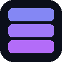

<p align="center">
  
</p>

<h1 align="center">TabPack</h1>

<p align="center">
  <strong>Compactador de Abas para Google Chrome</strong><br>
  Transforme dezenas de abas em grupos hibernados. Restaure quando precisar.
</p>

<p align="center">
  
  
  
</p>

---

## ✨ Funcionalidades

- **📦 Compactar abas** — Selecione múltiplas abas abertas e transforme-as em um único grupo hibernado, liberando memória do navegador
- **🔍 Busca inteligente** — Filtre abas e grupos em tempo real por título ou URL
- **🤖 Classificação automática** — Abas são organizadas em categorias (YouTube, GitHub, IA, Redes Sociais, Google, etc.) com detecção de links duplicados
- **⬇️ Exportar / ⬆️ Importar** — Faça backup dos grupos em arquivo JSON e importe depois
- **🌓 Tema claro/escuro** — Alterne entre modos com um clique
- **🌐 PT-BR / EN** — Interface disponível em português e inglês
- **↗️ Restauração individual** — Reabra apenas uma aba do grupo sem perder as demais
- **✨ Restaurar tudo** — Recrie todas as abas de uma vez

---

## 🎬 Como usar

### Compactar abas

1. Clique no ícone do **TabPack** na barra de ferramentas
2. Selecione as abas que deseja compactar (ou use "Selecionar todas")
3. Opcionalmente, dê um nome ao grupo (ex: "Pesquisa", "Trabalho")
4. Clique em **📦 Compactar**
5. Uma nova página de grupo será aberta com todas as abas hibernadas

### Gerenciar grupos salvos

- Abra o popup do TabPack para ver todos os grupos na seção "Grupos salvos"
- Clique em **↗** para abrir a página do grupo
- Clique em **✕** para excluir um grupo permanentemente

### Na página do grupo

- As abas são automaticamente **categorizadas** por serviço/domínio
- Categorias mostram contagem de abas e alerta de **duplicatas** ⚠️
- Expanda uma categoria para ver os cards das abas
- Clique em **↗ Abrir esta aba** para restaurar individualmente
- Use **✨ Restaurar todas** para recriar todas as abas de uma vez
- Use a **🔍 barra de busca** para encontrar abas específicas

### Backup

- Clique em **⬇ Exportar** para baixar um arquivo `.json` com todos os grupos
- Clique em **⬆ Importar** para carregar grupos de um backup anterior

---

## 🧩 Categorias reconhecidas

| Categoria | Serviços |
|-----------|----------|
| ▶️ YouTube | youtube.com, youtu.be |
| 🐙 GitHub | github.com, GitLab, Stack Overflow, npm, CodePen, Medium |
| 🤖 IA / LLMs | ChatGPT, Claude, Gemini, DeepSeek, Perplexity, Copilot, Hugging Face |
| 🔍 Google | Docs, Sheets, Drive, Gmail, Calendar, Meet, Photos, Search |
| 📧 Microsoft | Outlook, Office 365, Teams |
| 🐦 Redes sociais | X/Twitter, Reddit, LinkedIn, Instagram, Facebook, TikTok, Discord |
| 📰 Notícias | G1, CNN, BBC, UOL, Google News |
| 🛒 Shopping | Amazon, Mercado Livre, AliExpress, Shopee |
| 🎓 Aprendizado | Wikipedia, MDN, Udemy, Coursera, Notion, Figma, Trello |
| 🎵 Streaming | Spotify, Deezer, SoundCloud, Netflix, Twitch |
| 🌐 Outros | Agrupados por domínio |

---

## 📁 Estrutura do projeto

```
tabpack/
├── manifest.json       # Configuração da extensão (Manifest V3)
├── background.js       # Service worker — lógica principal
├── popup.html          # Interface do popup (400px)
├── popup.js            # Script do popup
├── group.html          # Página de exibição do grupo hibernado
├── group.js            # Script da página de grupo
├── shared.js           # Temas + i18n (PT/EN)
├── icons/              # Ícones (16, 32, 48, 128px)
└── README.md
```

## 🛠️ Stack

- **Manifest V3** com service worker
- **Vanilla JavaScript** — zero dependências
- **Chrome APIs** — `tabs`, `storage`
- **CSS custom properties** para theming dark/light
- **Fontes**: Sora (títulos) + JetBrains Mono (mono)

---

## 🔧 Instalação (modo desenvolvedor)

1. Clone ou baixe este repositório
2. Acesse `chrome://extensions` no Chrome
3. Ative o **Modo do desenvolvedor** (canto superior direito)
4. Clique em **Carregar sem compactação**
5. Selecione a pasta do projeto
6. O ícone do TabPack aparecerá na barra de ferramentas

---

## 📄 Licença

MIT © 2026

---

<p align="center">
  <sub>Feito com 💙 para quem vive com 147 abas abertas</sub>
</p>
